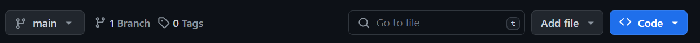

# EnvisionBOX Summer School 2025

This repository stores all materials for **EnvisionBOX summer school** which takes place between **23-27 June 2025** at University of Amsterdam.

To make sure we all start on the same page, please prepare your laptop by following the instructions below. 

## Get ready

### Step 1: Installing Python

To be able to follow the summer school and explore the coding procedures, you will need to have a Python available. 

The easiest way to get Python is installing [Anaconda](https://www.anaconda.com/download), a common platform for this programming language.

> [!IMPORTANT] 
> At some point during the installation process, you need to check :ballot_box_with_check: that you want **to add Anaconda/Python to system path**. Without that, your command prompt or the text editor will not know where to find executor. 

If you feel you need a guidance, you can follow one of many tutorials online (e.g., [here for Mac]( https://www.youtube.com/watch?v=YJC6ldI3hWk), and [here for Windows](https://www.youtube.com/watch?v=UTqOXwAi1pE)). 

### Step 2: Get yourself a text editor

To work with Python scripts, it is very convenient to have a text editor. Essentially, this can be any software that can edit texts. 

[Visual Studio Code](https://code.visualstudio.com/) for instance offers very nice GUI. Once you have installed it, you need to do few more adjustments so that VS Code can recognize a Python script. Go to Extension panel (*Ctrl + Shift + X*) and search for Python. Click on the install button. Do the same with extension Jupyter.

### Step 3: Clone/download the repository

Once you are all set up, it's time to get this repository to your PC.

Here, you can either use [Github Desktop](https://desktop.github.com/download/) which will later also allow you to synchronize your local version of this repository with any updates I may do here.

> [!NOTE] 
> **How to clone repository via Github?** After installing, launching Github Desktop, and signing in with your Github credentials, simply click on *File > Clone repository... > URL* and paste there the link to this repository, https://github.com/sarkadava/envisionBOX_SummerschoolAmsterdam2025

If you don't want to install yet another software, you can just download the repository. At the top of this page, click on **<> Code** and then **Download ZIP**. This will download the repository.


## Additional softwares

You will also need ELAN. Download the current version [here](https://archive.mpi.nl/tla/elan/download).

## Troubleshooting

Unfortunately, there are many things on the way that can go wrong - for many reasons. While it is impossible to cover all of them, here are the most common errors you may encounter.

### *pip: command not found*

This error occurs when your system does not know where to find the *pip* command. Pip is either not installed in your environment, or it is not added to the system path.

#### Solution nr. 1

You can install pip by typing

```
conda install pip
```

If it does not work, refer to the next solution.

#### Solution nr. 2

Go to system settings and search for *Environment Variables*. Click on *Environment Variables* and in the *System variables* find *Path*. Click on *Edit* and then *New*. Now you need to add the path to your Anaconda. This is usually in *C:\Users\YourName\anaconda3\python.exe*.

### *I don't see the desired environment in VS Code*

If you don't see the environment you have created in the list of available kernels, but are 100% sure that you have created it, go to your Anaconda Prompt and type

```
python -m ipykernel install --user --name=NameOfTheEnv
```

Now you should see it in the list of available kernels. Note that maybe you will need to restart your VS Code.

### *ModuleNotFoundError: No module named 'mediapipe'*

If during the Step 5 you get this error (or some other module is missing), it means that the package was not installed. 

#### Solution nr. 1

You can try either reinstalling the whole requirements

```
pip install -r requirements.txt
```
>[!IMPORTANT]
> Make sure that you are in your desired environment. It should be displayed in brackets at the beginning of your prompt.

#### Solution nr. 2

Or just install the missing package

```
pip install mediapipe
```

### Did we not address your problem?

If you have encountered a problem that is not listed here, please let us know - ideally **before** the summer school. We will do our best to help you out. You can reach us via email *kadava[et]leibniz-zas[dot]de*